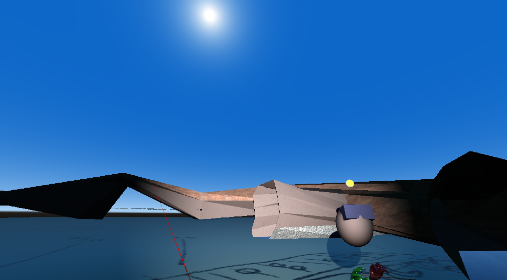

## Introduction 

**TunnelVR** is a follow-on from [TunnelX](https://github.com/CaveSurveying/tunnelx) -- a long-running 
program for drawing up cave surveys.  It's based on the excellent 
[Godot Game Engine](https://godotengine.org/) that's used for designing 
Virtual Reality games on an almost plug and play basis.

Being like a game, the intention is to make drawing up cave surveys fun and collaborative.  
You can make improvements to the map with your friends in VR.  It is easier and more intuitive 
because it is in 3D from the perspective of how you see it in the real life, rather than 
as a technical 2D drawing with overlapping layers.

## How to run

### As a binary executable

Go to the [releases](https://github.com/goatchurchprime/tunnelvr/releases) page and download, unzip and run 
the binary executable for your operating system.  Linux, Windows and Oculus Quest Android are available, and 
iOS is sometimes available when someone makes a build on a Mac.

### From sources

This is super easy owing to the power of Godot.  

Clone this repo

Download and run the [Standard release of Godot](https://godotengine.org/download) for your operating system.

Scan project directory for tunnelvr and then open it.  

Download the godot_ovrmobile asset if you are deploying to the Oculus Quest

Hit the "Play" button on the top right

## Controls

### The non-VR pancake flatscreen interface

If you do not have a VR system, you can use TunnelVR in the following way:

* Cursor keys or WASD keys will move forwards, backwards and rotate your camera view left and right.
* Shift-Up/Down or W/S keys rotates your view up and down (nodding your head)
* Esc-key or '1' toggles mouse capture.  The mouse controls the hand-laser-cursor used for drawing
* Right mouse (when captured) brings up a context sensitive menu.  For example, if cursor was on a wall, the Right mouse allows for changing the material.
* Ctrl-Up/Down turns off gravity and flies forwards or backwards in the direction of view.  Try looking down first (Shift-S) then flying backwards (Ctrl-S) to get a view of the scene from above.
* 'M'-key toggles control panel menu.  Use this to join the network (select Network Off -> tunnelvr.goatchurch.org.uk) will connect you to the main server where you can meet with other players and be shown around
 
### In-VR controls

Controllers and hand tracking works.  Controller buttons animates the hands to the appropriate gesture: 
* thumb and forefinger pinch is same as trigger button, 
* thumb and middle finger pinch is grip button
* thumb and pinky and ring finger at same time is menu button

### *Left hand* is for movement.
* Thumb-stick forwards and backwards -- slides in direction of view
* Trigger -- slides in direction of the short orange laser emerging from the controller or hand
* Thumb-stick left or right -- rotates view 45 degrees left or right
* Grip -- turns off gravity and allows flying or hovering
* Grip+Trigger -- Flies in direction of controller axis
* Grip+Touchpad+Trigger -- Flies in direction of controller at 5x speed.

### *Right hand* is for drawing.
Cave walls are done by creating polygons in vertical (sometimes horizontal) XC panes and then joining nodes between these polygons to create tubes that are divided into sectors.
There is a laser pointer coming out of the palm with a range of 50m.
* Trigger on unselected node -- selects node and draws or deletes a line if there is a previously selected node.  
If it is part of an unselected XC pane, then it selects the pane and the pointer will see through walls to reach it.
* Trigger on selected node -- deselects node
* Trigger on XC pane with node selected -- continues drawing a sequence
* Grip+Trigger on XC pane -- Moves selected node
* Grip+Trigger on selected node -- Deletes node
* Grip+ungrip on selected XC pane -- deselects XC pane
* Grip+ungrip otherwise -- deselects selected node
* Trigger on an active tube, then release on disk then click a point on the disk -- Creates an intermediate node which distorts the wall of the tube
* Grip on target+select menu option+release -- executes a context sensitive command or changes material
* Menu button (above touchpad) -- Open dialog window with further controls

### Grip menu options
* SelectXC
* HideXC
* DeleteXC
* DeleteTube

### Gestures
* Right hand twisted to the right and moved rapidly towards face -- shorten laser pointer to enter rope drawing mode
* Right hand twisted to the right and moved rapidly away from face -- return to normal pointer mode

## Geometric principle

The cave is made from a series of cross sections.  Most cross sections have a single contour, 
but junctions can have two lines cutting the outer contour to separate it into three internal areas.
Connections between nodes in one cross section to nodes in another cross section defines a tube.
The tube goes between the internal area that spans the connections or the outer area if none do.
Multiple connections divide the tube into sectors that can be assigned with different materials.
Tubes should never self-intersect (where the planes of cross sections cut through the contour) or 
intersect with other tubes.  It is always possible to change the cross-sections or insert new ones 
to handle a difficult junction area.  In the extreme case, the cave could be modelled as a sliced 
CAT scan with 1mm thick layers all perpendicular to the X-axis.  However, capability to 
change the orientation of the slices makes the modelling more symetrical.

## Input data

Cave data is sourced from [Cave-Registry](http://cave-registry.org.uk/) [NorthernEngland](http://cave-registry.org.uk/svn/NorthernEngland/)
in processed [survex 3d format](https://survex.com/docs.html).  It requires one of the computers on the network to be able to 
execute `python` and `dump3d` from a command line to convert this into the geometry format that TunnelVR needs.

# Running on a server

Any running copy of TunnelVR can act as a server by selecting Network Off -> As Server.  If another instance is running on the same
local area network, then doing Network Off -> Local-network will find and connect to the designated server.

Download the [headless server version](https://godotengine.org/download/server), unpack the linux zip file, then execute:

> ./Godot_v3.3.1-stable_linux_server.64  --main-pack tunnelvr_v0.5.0.pck

Execute this in a [screen](https://linuxize.com/post/how-to-use-linux-screen/) terminal window to allow it to persist.  

